  

<h1 align="center">Hi, I'm Oshada</h1>

<h3 align="center">
  Computer Engineering Undergraduate at University of Peradeniya |
  Full-Stack Developer |
  Tech Enthusiast
</h3>

  

---

### About Me

- I’m currently working on web development projects
- I’m currently learning JavaScript, React, and UI/UX
- Ask me about HTML, CSS, JavaScript, React, Python, and Java
- Contact me: [oshadashashinidu2002@gmail.com](mailto:oshadashashinidu2002@gmail.com)
- I enjoy building clean, modern, and user-friendly applications

---

### Technologies I Use

  

---

### GitHub Contributions

  

  Automatically updated every 6 hours using GitHub Actions

---

### GitHub Activity Graph

  

---

### Top Languages

  

---

### Connect With Me

  

  

