<!-- =============================================================== -->
<!--                 OSHADA SHASHINIDU · GITHUB PROFILE              -->
<!-- =============================================================== -->

  

  
  
  

  <a href="#-about-me">About</a> •
  <a href="#-current-focus">Current Focus</a> •
  <a href="#-technology-toolbox">Toolbox</a> •
  <a href="#-github-analytics">Analytics</a> •
  <a href="#-lets-connect">Connect</a>

 

## 👨‍💻 About Me

I’m **Oshada Shashinidu**, a Computer Engineering undergraduate at the **University of Peradeniya** with a passion for creating modern, practical, and user-friendly software.

I enjoy the full journey from a rough idea to a polished product—planning the experience, writing clean code, solving the tricky parts, and refining the details that make an application feel great.

- 🎓 Exploring the intersection of **engineering, software, and design**
- 🚀 Building responsive **web development projects**
- 🌱 Deepening my knowledge of **JavaScript, React, and UI/UX**
- 💬 Happy to talk about **HTML, CSS, JavaScript, React, Python, and Java**
- ⚡ Driven by curiosity, thoughtful design, and continuous improvement

## 🎯 Current Focus

| `01 · BUILD` | `02 · LEARN` | `03 · CREATE` |
|:---:|:---:|:---:|
| Full-stack web experiences | React & modern JavaScript | Clean, intuitive interfaces |
| Responsive applications | UI/UX principles | Useful real-world projects |

> **My approach:** understand the problem → design a clear solution → build with care → learn from every iteration.

## 🧰 Technology Toolbox

### Languages & Web

### Frameworks & Workflow

 
 

## 📊 GitHub Analytics

  

  
  

### Contribution Journey

  

Contribution totals are refreshed automatically every 6 hours with GitHub Actions.

## 🤝 Let’s Connect

  I’m always glad to meet fellow developers, exchange ideas, and explore meaningful collaborations.

  
  
  

 

  
   
  Designed with curiosity, built with code, and improved one commit at a time.

<!-- Thanks for visiting. Have a brilliant day! -->
